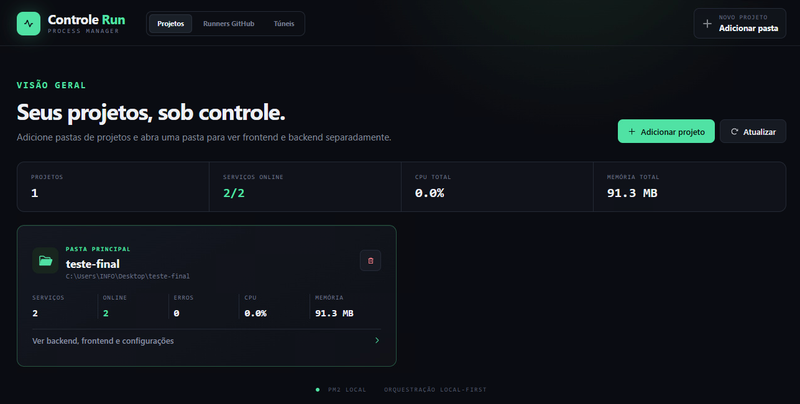
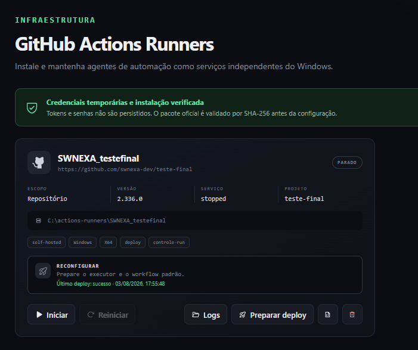
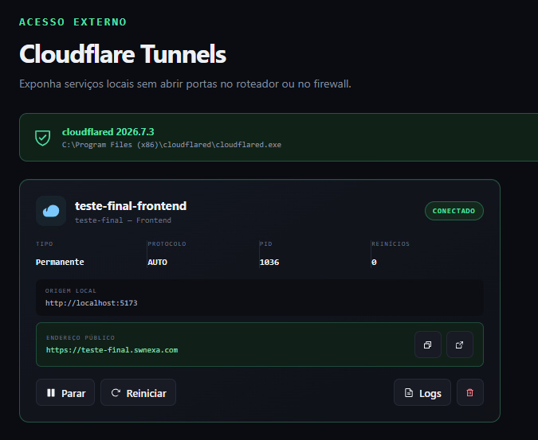
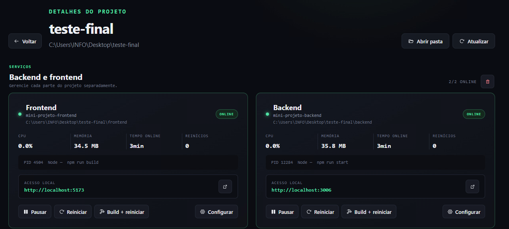
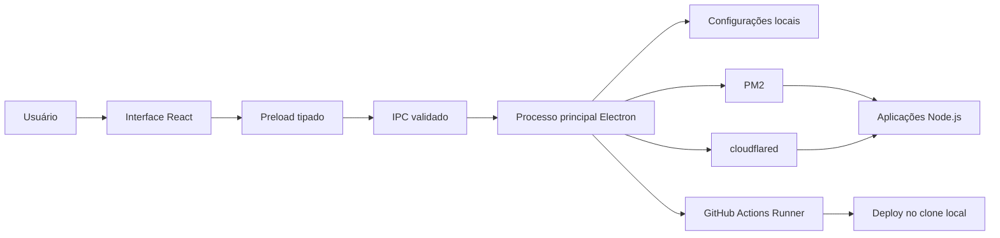

# Controle Run

<p align="center">
  <strong>Seu painel local para executar, publicar e automatizar aplicações Node.js no Windows.</strong>
</p>

<p align="center">
  Um aplicativo desktop <em>local-first</em> que reúne processos PM2, deploy por GitHub Actions self-hosted e exposição segura com Cloudflare Tunnel em uma única interface.
</p>

<p align="center">
  <a href="#comece-em-minutos">Começar</a> ·
  <a href="#recursos">Recursos</a> ·
  <a href="#arquitetura">Arquitetura</a> ·
  <a href="#segurança">Segurança</a>
</p>

<p align="center">
  <a href="https://github.com/swnexa-dev/controle-run/actions"></a>
  <a href="https://github.com/swnexa-dev/controle-run/releases"></a>
  <a href="https://github.com/swnexa-dev/controle-run/blob/master/package.json"></a>
  <a href="https://www.typescriptlang.org/"></a>
</p>

> **Status:** em desenvolvimento ativo.


## Por que existe?

Colocar aplicações Node.js em execução em uma máquina Windows costuma espalhar tarefas entre terminal, PM2, serviços, GitHub Actions e configurações de túnel. O Controle Run reduz esse atrito: ele descobre projetos, controla seus processos e centraliza a automação de deploy — sem exigir que credenciais sensíveis fiquem expostas na interface ou em arquivos de configuração.

## Recursos

| Área | O que o Controle Run faz |
| --- | --- |
| **Projetos e PM2** | Detecta frontend e backend, sugere comandos de execução, inicia, pausa, reinicia, remove e acompanha processos locais. |
| **GitHub Actions Runners** | Instala e administra runners self-hosted de organização ou repositório como serviços do Windows. |
| **Deploy local** | Prepara um workflow isolado por runner, valida o repositório publicado e reinicia processos PM2 com tentativa de rollback em caso de falha. |
| **Cloudflare Tunnels** | Cria túneis temporários para demonstrações ou conecta túneis permanentes por token, com URL pública, logs e estado na interface. |
| **Recuperação no logon** | Restaura projetos e túneis marcados para início automático após o login do Windows. |

## Galeria

<table>
  <tr>
    <td align="center"><br><sub>Projetos e processos</sub></td>
    <td align="center"><br><sub>Runners e deploy</sub></td>
  </tr>
  <tr>
    <td align="center"><br><sub>Túneis Cloudflare</sub></td>
    <td align="center"><br><sub>Configuração do projeto</sub></td>
  </tr>
</table>

## Arquitetura



O Electron separa interface, ponte de comunicação e acesso ao sistema operacional. A interface não recebe acesso direto ao Node.js: operações privilegiadas passam por canais IPC validados no processo principal.

## Segurança

- `contextIsolation` habilitado, integração direta com Node.js desabilitada e sandbox do Electron ativo;
- canais IPC aceitam apenas eventos da janela confiável;
- tokens de GitHub e Cloudflare não são devolvidos à interface nem gravados em texto puro;
- dados temporários usados em ações elevadas são protegidos com DPAPI do Windows e removidos ao final;
- downloads de runners e `cloudflared` são verificados com SHA-256 oficial.

## Comece em minutos

### Pré-requisitos

- Windows 10 ou 11;
- Node.js em uma versão LTS atual;
- Git, caso vá usar o deploy automático;
- uma conta GitHub, caso vá configurar um runner;
- conta Cloudflare apenas para túneis permanentes.

### Desenvolvimento

```bash
git clone https://github.com/swnexa-dev/controle-run.git
cd controle-run
npm install
npm run dev
```

### Validação

```bash
npm test
npm run build
```

### Instalador Windows

Quando uma release estiver disponível, o instalador poderá ser baixado na página de [releases](https://github.com/swnexa-dev/controle-run/releases).

Para gerar o instalador localmente, execute:

```powershell
npm run package:win
```

O instalador é criado na pasta `release`.

## Como funciona

### 1. Adicione um projeto

Selecione a pasta do projeto. O Controle Run procura `frontend` e `backend` e cria serviços independentes para cada um. Projetos simples, com `package.json` na raiz, também são compatíveis.

```text
meu-projeto/
├── frontend/
│   └── package.json
└── backend/
    └── package.json
```

O aplicativo prioriza scripts `start`, `serve` e `dev`; se não encontrar uma opção adequada, você pode escolher um script NPM ou informar o arquivo de entrada sem modificar o projeto original.

### 2. Automatize o deploy (opcional)

Para um runner com escopo de repositório, conta Windows específica e projeto associado, o botão **Preparar deploy**:

1. valida se o `origin` do clone local pertence ao repositório do runner;
2. cria `.github/workflows/controle-run.yml` com uma label exclusiva;
3. instala o executor local e registra a pasta publicada;
4. direciona pushes em `main` ou `master` apenas para aquele runner;
5. preserva arquivos não rastreados, como `.env`, e tenta restaurar o commit anterior se o reinício falhar.

### 3. Publique com Cloudflare Tunnel (opcional)

Associe um serviço a um túnel temporário para uma demonstração rápida, ou conecte um túnel permanente por token. O aplicativo mostra URL, conexão, PID, reinícios e logs, e permite administrar o conector local sem apagar o túnel remoto da sua conta Cloudflare.

## Detalhes técnicos

<details>
<summary><strong>GitHub Actions Runners</strong></summary>

O Controle Run consulta a release Windows x64 mais recente, armazena o ZIP localmente e valida o SHA-256 oficial antes da extração. O runner é instalado como serviço do Windows em `C:\actions-runners\&lt;nome&gt;` e pode usar `NT AUTHORITY\NETWORK SERVICE` ou uma conta Windows específica. Tokens de registro e remoção nunca são gravados no `settings.json`.

</details>

<details>
<summary><strong>Persistência e recuperação</strong></summary>

O cadastro local é validado por schema, gravado atomicamente e espelhado em `settings.json.bak`. Na versão instalada, uma entrada de inicialização do Windows pode restaurar projetos e túneis após o logon da mesma conta que os criou.

</details>

<details>
<summary><strong>Limitações intencionais</strong></summary>

O foco atual é Windows. A recuperação automática acontece após o logon, porque PM2, diretórios de projeto e credenciais protegidas pelo DPAPI pertencem à conta Windows que os configurou. Iniciar antes do logon exigiria um serviço dedicado e uma identidade de serviço com acesso explícito a esses recursos.

</details>

## Roadmap

- [x] Gerenciamento local de processos com PM2
- [x] Runners GitHub self-hosted como serviço Windows
- [x] Deploy automatizado com rollback
- [x] Túneis Cloudflare temporários e permanentes
- [x] Recuperação automática após logon
- [ ] Pipeline de integração contínua no GitHub Actions
- [ ] Galeria e demonstração em vídeo
- [ ] Documentação de contribuição e política de segurança

## Contribuindo

Contribuições serão bem-vindas quando o guia de contribuição estiver publicado. Enquanto isso, abra uma issue descrevendo o contexto, o comportamento esperado e a versão utilizada.

## Licença

A licença será definida antes da primeira release pública.

---

<p align="center">
  Feito para simplificar a operação de projetos Node.js no Windows.<br>
  <a href="https://github.com/swnexa-dev/controle-run/issues">Reportar problema</a> ·
  <a href="https://github.com/swnexa-dev/controle-run/discussions">Discussões</a>
</p>
